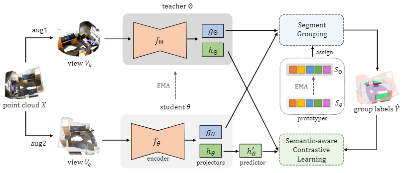

# GroupContrast

This repo is the official project repository of the paper **_GroupContrast: Semantic-aware Self-supervised Representation Learning for 3D Understanding_** and is mainly used for releasing schedules, updating instructions, sharing experiment records (contains model weight), and handling issues. The code will be updated in _[Pointcept](https://github.com/Pointcept/Pointcept)_.  

[GroupContrast] - [ [arXiv](https://arxiv.org/abs/2403.09639) ] [ [Code](https://github.com/Pointcept/Pointcept) ]

<div align='left'>

</div>

## Highlights
- *Mar, 2023*: We release the project repo for GroupContrast, if you have any questions related to our work, please feel free to open an issue.

## Schedule
Our code release schedule is as follows:

- [ ] Release pre-training config and code of GroupContrast;
  - [ ] ScanNet
- [ ] Release semantic segmentation fine-tuning code and config;
  - [ ] ScanNet
  - [ ] ScanNet200
  - [ ] S3DIS
  - [ ] ScanNet data efficient
- [ ] Release instance segmentation fine-tuning code and config;
  - [ ] ScanNet
  - [ ] ScanNet200
  - [ ] S3DIS
- [ ] Release object detection fine-tuning code and config;
  - [ ] ScanNet
  - [ ] SUN-RGBD

## Citation
If you find _GroupContrast_ useful to your research, please cite our work as an acknowledgment.
```bib
@inproceedings{wang2023gc,
    title={GroupContrast: Semantic-aware Self-supervised Representation Learning for 3D Understanding}, 
    author={Wang, Chengyao and Jiang, Li and Wu, Xiaoyang and Tian, Zhuotao and Peng, Bohao and Zhao, Hengshuang and Jia, Jiaya},
    booktitle={Proceedings of the IEEE/CVF Conference on Computer Vision and Pattern Recognition (CVPR)},
    year={2024}
}

@inproceedings{wu2024ppt,
    title={Towards Large-scale 3D Representation Learning with Multi-dataset Point Prompt Training},
    author={Wu, Xiaoyang and Tian, Zhuotao and Wen, Xin and Peng, Bohao and Liu, Xihui and Yu, Kaicheng and Zhao, Hengshuang},
    booktitle={Proceedings of the IEEE/CVF Conference on Computer Vision and Pattern Recognition (CVPR)},
    year={2024}
}

@inproceedings{wu2023msc,
  title={Masked Scene Contrast: A Scalable Framework for Unsupervised 3D Representation Learning},
  author={Wu, Xiaoyang and Wen, Xin and Liu, Xihui and Zhao, Hengshuang},
  journal={Proceedings of the IEEE/CVF Conference on Computer Vision and Pattern Recognition (CVPR)},
  year={2023}
}

@misc{pointcept2023,
    title={Pointcept: A Codebase for Point Cloud Perception Research},
    author={Pointcept Contributors},
    howpublished={\url{https://github.com/Pointcept/Pointcept}},
    year={2023}
}
```
